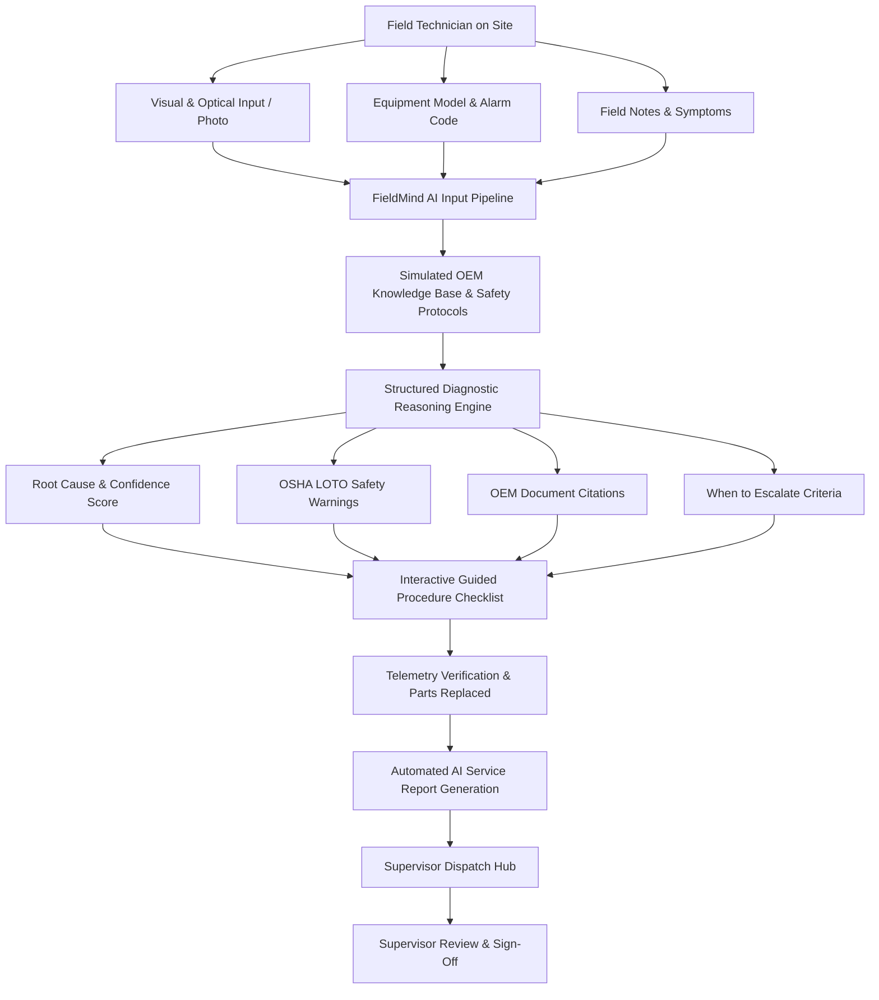
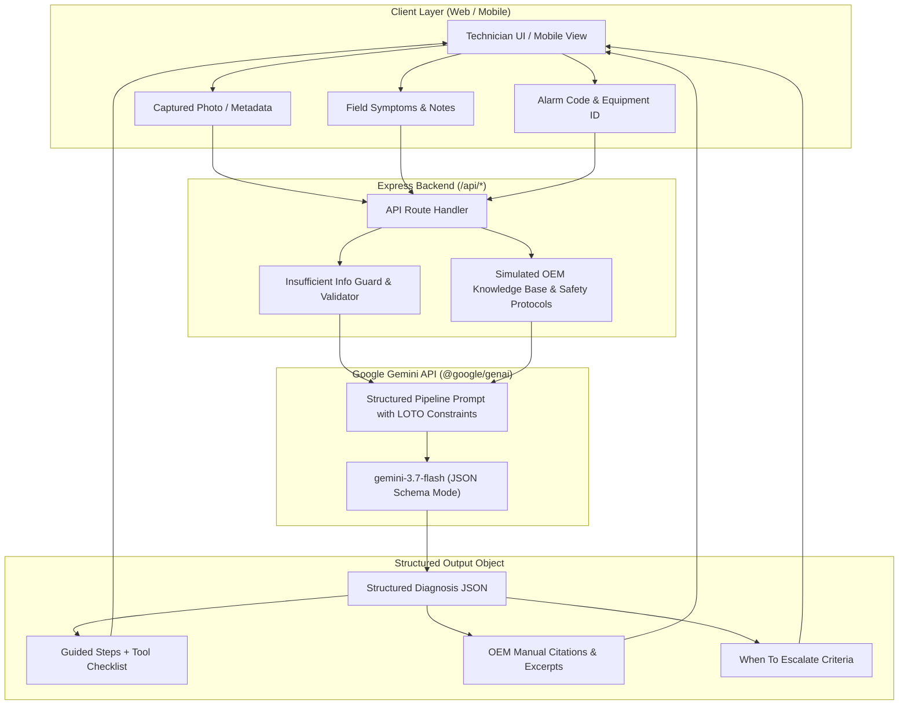
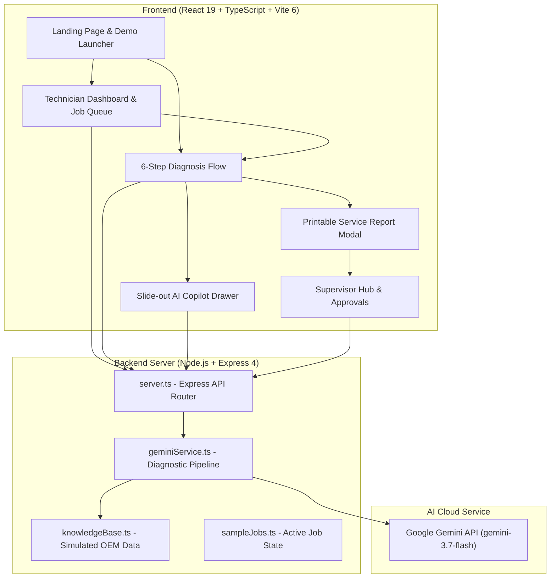

# FieldMind AI

> An AI expert in every field worker's pocket.

FieldMind AI is a phone-first intelligent copilot designed for industrial and commercial field service technicians. Built for high-stakes environments, it combines computer vision, contextual diagnostic reasoning, guided step-by-step procedures, and automated report generation to support field workers at the equipment site. The current MVP focuses on commercial HVAC scenarios, demonstrating how multimodal AI and grounded technical documentation assist technicians during complex troubleshooting workflows.

---

# 🎯 Problem

Field service technicians operate in demanding physical environments where equipment downtime is costly and safety is critical. When arriving on-site, a technician frequently encounters:

- **Unfamiliar or Legacy Machinery**: Hundreds of diverse equipment models, revisions, and configurations across customer facilities.
- **Cryptic Error & Alarm Codes**: Numerical fault codes (e.g., `E04`, `E07`) that require immediate cross-referencing against vendor documentation.
- **Unidentified Components**: Worn, obscured, or damaged components that cannot be immediately diagnosed by eye alone.
- **Complex Multi-Step Procedures**: Strict manufacturer requirements for electrical isolation, refrigerant recovery, and sensor calibration.
- **Voluminous OEM Manuals**: 200+ page technical PDF manuals that are difficult to search on a mobile device under field conditions.
- **Dispersed Service Histories**: Lack of readily accessible historical maintenance records for specific machines on site.

### Traditional Field Workflow

```
Equipment Problem
  → Search Manual
    → Search Online
      → Contact Senior Expert
        → Wait for Response
          → Troubleshoot
            → Write Report Manually
```

### Key Industry Challenges

- **Slow Information Retrieval**: Technicians spend up to 30–45% of on-site time locating relevant wiring diagrams and fault tables.
- **Heavy Dependence on Senior Technicians**: Junior technicians frequently call senior specialists for basic troubleshooting, creating operational bottlenecks.
- **Difficulty Interpreting Complex Manuals**: Dense schematics and multi-stage procedures increase the risk of misdiagnosis.
- **Repetitive Troubleshooting Cycles**: Unstructured diagnostic workflows lead to missed steps and repeat truck rolls.
- **Manual, Inconsistent Documentation**: Handwritten or delayed service tickets cause data loss, billing delays, and compliance issues.
- **Safety Hazards in High-Energy Work**: Missing a safety step (such as Lock-Out / Tag-Out or capacitor discharge) poses severe risks.

> Field workers have the equipment. They don't always have the expertise beside them.

---

# 💡 Solution

FieldMind AI transforms any modern smartphone into a contextual AI copilot for field service operations. By combining visual inspection metadata, alarm codes, technician observations, and manufacturer documentation into a structured reasoning pipeline, FieldMind AI delivers actionable, safety-first troubleshooting guidance directly to the worker's hands.

### The FieldMind AI Workflow

```
Problem
  → Capture / Enter Information
    → AI Understands Context
      → Retrieve Relevant Technical Knowledge
        → AI-Assisted Diagnosis
          → Guided Troubleshooting
            → Complete Job
              → Service Report
```

> **Note on MVP Scope**: The current implementation features a fully functional, end-to-end web application with a simulated commercial HVAC knowledge base (rooftop units, modular chillers, air handlers, VRF systems, and VAV boxes). It demonstrates real-time Gemini-powered diagnostic reasoning, grounded OEM citations, OSHA LOTO safety checks, interactive checklist execution, and automated supervisor reporting.

---

# 🔄 Product Workflow



---

# ⭐ Key Features

## 📷 Multimodal Equipment Assistance
- **Visual Symptom Capture**: Technicians can capture live equipment photos or upload inspection images (supporting camera input and file drag-and-drop).
- **Preset Optical Inspection Samples**: Built-in test samples for common failure states (e.g., condenser coil blockage, compressor overload terminal, belt deflection, frost accumulation, actuator linkage).
- **Metadata Binding**: Optical inspection metadata is bound directly to the diagnostic session and injected into the AI context.

## 🧠 AI-Assisted Diagnosis
- **Structured Diagnostic Reasoning Pipeline**: Server-side engine powered by `@google/genai` (Gemini 3.7 Flash) returning structured JSON with:
  - Identified equipment and issue summary
  - Direct likely cause of failure
  - Calibrated diagnostic confidence score (0–100%)
  - Severity level (`low`, `medium`, `high`, `critical`)
  - OSHA Lock-Out / Tag-Out (LOTO 1910.147) and PPE safety warnings
  - Actionable step-by-step guided repair instructions
  - Specific OEM manual citations and excerpt quotations
  - Concrete escalation thresholds detailing when to contact senior engineers
- **Zero-Hallucination Safety Guardrails**: If supplied equipment or alarm codes are missing or unrecognized, the system automatically triggers an **Insufficient Information Safety Hold** rather than generating speculative or unsafe repair instructions.

## 📚 Technical Knowledge & Grounding
- **Simulated OEM Knowledge Base**: Pre-loaded with 5 major commercial HVAC equipment profiles and 10 detailed alarm codes (`E01`–`E10`):
  - *TitanAir RTU-10X Rooftop Unit* (Carrier WeatherMaster reference)
  - *ArcticShield Modular Chiller 50T* (Trane Series R reference)
  - *AeroFlow AHU-800 Central Air Handler* (Johnson Controls reference)
  - *MultiV Inverter VRF-12M Heat Recovery* (Daikin VRV reference)
  - *AeroVAV Pressure-Independent Terminal* (Honeywell BACnet reference)
- **Verified Document Citations**: Every generated diagnostic step cites the exact simulated OEM manual, section number, and engineering excerpt.
- **RAG Architecture Status**: *Context-aware RAG with dynamic vector indexing is part of the planned architecture; the current MVP operates on a curated, simulated OEM technical knowledge base embedded in the reasoning pipeline.*

## 💬 Context-Aware AI Copilot Chat
- **Slide-out Copilot Drawer**: Interactive assistant available at any stage of diagnosis.
- **Equipment & Step Context**: Automatically passes current machine specifications, active alarm code, and current step number into conversation prompts.
- **Dynamic Suggested Prompts**: Generates contextual one-click prompt suggestions (e.g., multimeter test points, LOTO steps, escalation criteria).

## 📝 Automated Service Reports
- **1-Click AI Report Generation**: Synthesizes completed checklist steps, verified telemetry readings, replaced parts, and field notes into a standardized commercial service ticket.
- **Compliance & Safety Badging**: Records electrical isolation verification, technician signature, duration, and supervisor recommendations.
- **PDF Print / Export Ready**: Includes high-fidelity print stylesheets, printable barcode/QR verification, and direct auto-saving to the supervisor queue.

## 📊 Supervisor & Dispatch Dashboard
- **Fleet Dispatch Queue**: Real-time overview of field jobs, priority statuses, assigned technicians, and diagnostic states.
- **Report Review & Approval**: Dedicated review modal allowing supervisors to inspect full telemetry snapshots, root causes, and sign off on completed work.
- **10-Case Benchmark Test Suite**: Built-in verification runner testing all 10 simulated HVAC error codes against the structured reasoning pipeline with live pass/fail reporting.

---

# 📱 Android Application

The mobile concept is organized in the `/android` directory structure to target smartphone-first field operations:

- **Target Platform**: Android (Kotlin / Jetpack Compose architecture)
- **Camera & Sensor Access**: Visual equipment nameplate scanning and component photo capture.
- **Mobile Workflow**:
  1. Quick QR/barcode or nameplate photo capture.
  2. One-tap alarm code entry and voice note transcription.
  3. Mobile-optimized step-by-step checklist with offline safety fallback.
  4. Digital job sign-off and report dispatch back to central office.
- **Permissions**: Camera (`android.permission.CAMERA`), network state, and local storage caching.
- **Current Status**: The mobile app architecture is designed to interface with the FieldMind backend API (`/api/diagnose`, `/api/chat`, `/api/reports`). The complete functional demonstration is hosted and executable via the full-stack web client and Express API server.

---

# 🌐 Web Application

The primary web platform delivers both a mobile-responsive field technician view and a comprehensive supervisor management portal:

- **Frontend Framework**: React 19 with TypeScript and Vite 6.
- **Styling**: Tailwind CSS v4 with custom responsive utilities.
- **Animation & Transitions**: `motion` (Motion for React).
- **Icons**: `lucide-react`.
- **Backend / Server**: Node.js with Express 4.21, running TypeScript in development via `tsx` and bundled via `esbuild` for production (`dist/server.cjs`).
- **AI Integration**: `@google/genai` (v2.4.0) calling the `gemini-3.7-flash` model with structured JSON Schema enforcement.
- **REST Endpoints**:
  - `POST /api/diagnose` — Structured diagnostic reasoning pipeline.
  - `POST /api/chat` — Contextual AI copilot assistant with follow-up recommendations.
  - `POST /api/reports/generate` — Automated service report generator.
  - `GET /api/reports` & `POST /api/reports` — In-memory report persistence and retrieval.
  - `GET /api/test-diagnostic-pipeline` — 10-case automated benchmark test runner.
  - `GET /api/health` — Service health check.

---

# 🤖 AI Architecture



---

# 📚 RAG Knowledge Base

### Current Implementation
The current MVP utilizes a curated, in-memory simulated OEM knowledge base (`src/data/knowledgeBase.ts`) containing:
- Comprehensive technical specifications (refrigerant, tonnage, electrical voltage, manual titles, and document IDs).
- 10 detailed alarm code profiles (`E01`–`E10`) with baseline severities, physical root causes, OSHA warnings, step-by-step procedures, and document citation strings.
- Grounded prompt injection: Exact manual excerpts and safety standards are injected into the Gemini 3.7 Flash prompt alongside strict JSON schema constraints.

### Planned RAG Evolution
> Context-aware RAG is part of the planned architecture and will allow FieldMind AI to ingest raw OEM PDF manuals, wiring diagrams, and historic service records into an embedding pipeline (vector database) for dynamic similarity search and multi-document retrieval before generating responses.

---

# 📱 Why Phone-First AI?

Modern field technicians do not carry laptops onto rooftops, into boiler rooms, or inside crawlspaces. The smartphone is the technician's primary on-site computing device:

- **Camera**: Provides instant visual context of equipment labels, frost patterns, burned contactors, and linkage alignments.
- **Microphone**: Enables hands-free voice notes and queries while holding tools.
- **Display**: Presents clean, high-contrast, step-by-step checklists that can be operated with one hand.
- **Mobility**: Delivers guidance directly at the physical point of repair.
- **AI**: Synthesizes complex vendor knowledge at the point of action.

> The phone is not just the screen. It is the field worker's AI interface.

---

# 💻 Office Kit Integration Concept

The FieldMind AI workflow bridges the physical field environment with central office management:

```
+---------------------+          +------------------------+          +--------------------+
|     iQOO Phone      |  <====>  |   Office Kit Bridge    |  <====>  |   Office Laptop    |
|   (Field Device)    |          |   (Sync & Telemetry)   |          | (Supervisor Hub)   |
+---------------------+          +------------------------+          +--------------------+
| - Optical capture   |          | - Service ticket sync  |          | - Fleet dispatch   |
| - Voice notes       |          | - Diagnostic telemetry |          | - Knowledge base   |
| - Step checklist    |          | - Report serialization |          | - Report approvals |
| - On-site sign-off  |          | - Remote copilot sync  |          | - Tech analytics   |
+---------------------+          +------------------------+          +--------------------+
```

> **Note**: The Office Kit synchronization pipeline represents an architectural concept for seamless field-to-office coordination. In the current MVP, this workflow is demonstrated through shared backend API state between the Technician Workspace and Supervisor Dispatch Hub.

---

# 🏗️ System Architecture



---

# 🛠️ Technology Stack

## Mobile (Target Architecture)
- **Platform**: Android
- **Language**: Kotlin
- **UI Toolkit**: Jetpack Compose
- **Camera**: CameraX API

## Web Frontend
- **Framework**: React 19 (`react`, `react-dom`)
- **Language**: TypeScript (`typescript ~5.8`)
- **Styling**: Tailwind CSS v4 (`@tailwindcss/vite`, `tailwindcss`)
- **Animation**: `motion` (`motion/react`)
- **Icons**: `lucide-react`
- **Build Tool**: Vite 6 (`@vitejs/plugin-react`, `vite`)

## Backend & API
- **Runtime**: Node.js (ES Modules with TypeScript support)
- **Web Server**: Express 4.21 (`express`, `@types/express`)
- **Development Server**: `tsx`
- **Production Bundler**: `esbuild` (targeting `dist/server.cjs`)
- **Environment Management**: `dotenv`

## AI & Machine Learning
- **SDK**: Google GenAI SDK (`@google/genai` v2.4.0)
- **Model**: `gemini-3.7-flash`
- **Reasoning Protocol**: JSON Schema Mode with typed structured outputs, zero-hallucination guardrails, and deterministic fallback logic.

## Deployment & Hosting
- **Container Environment**: Cloud Run (Single-port 3000 ingress with Vite middleware integration in development and static asset serving in production).

---

# 📁 Repository Structure

```
FieldMind-AI/
├── .env.example              # Template for required environment variables
├── .gitignore                # Git ignore rules for node_modules and build artifacts
├── index.html                # HTML entry point with responsive viewport and metadata
├── metadata.json             # Application metadata, permissions, and capabilities
├── package.json              # Project dependencies, build scripts, and engine specs
├── tsconfig.json             # TypeScript compiler configuration
├── vite.config.ts            # Vite configuration with Tailwind CSS plugin
├── server.ts                 # Express server with API routes and Vite middleware
├── server/
│   └── geminiService.ts      # Structured diagnostic pipeline, chat copilot, and test runner
└── src/
    ├── main.tsx              # React application entry point
    ├── App.tsx               # Primary view router, state management, and modal handlers
    ├── types.ts              # Global TypeScript interfaces, enums, and data schemas
    ├── index.css             # Global Tailwind CSS imports
    ├── data/
    │   ├── knowledgeBase.ts  # Simulated OEM equipment profiles, error codes, and photos
    │   └── sampleJobs.ts     # Dispatch job queue and historical service tickets
    └── components/
        ├── LandingPage.tsx          # Product overview, architecture breakdown, and demo launch
        ├── TechnicianDashboard.tsx  # Dispatch workspace, job cards, and 10-case test suite
        ├── DiagnosisFlow.tsx        # 6-step guided diagnostic & repair procedure
        ├── AiChatDrawer.tsx         # Slide-out interactive AI copilot
        ├── SupervisorDashboard.tsx  # Supervisor queue, approvals, and fleet metrics
        ├── ServiceReportModal.tsx   # Standardized service ticket with PDF print styling
        └── Navbar.tsx               # Top navigation, view selector, and status indicators
```

---

# 🚀 Getting Started

## Prerequisites
- **Node.js**: v18.0.0 or higher (v20+ recommended)
- **npm** or **bun** package manager
- **Gemini API Key**: A valid Google Gemini API key from [Google AI Studio](https://aistudio.google.com/)

## Web Application Setup

1. **Clone the repository**:
   ```bash
   git clone https://github.com/atharvanavgire10/FieldMind-AI.git
   cd FieldMind-AI
   ```

2. **Install dependencies**:
   ```bash
   npm install
   ```

3. **Configure Environment Variables**:
   Create a `.env` file in the root directory using `.env.example` as a template:
   ```bash
   cp .env.example .env
   ```
   Add your Gemini API key:
   ```env
   GEMINI_API_KEY="your_actual_gemini_api_key_here"
   ```

4. **Run the Development Server**:
   ```bash
   npm run dev
   ```
   The application will start on `http://localhost:3000`.

5. **Build for Production**:
   ```bash
   npm run build
   npm start
   ```

---

# 🧪 Demo Scenario

Experience the complete FieldMind AI end-to-end workflow in under 3 minutes:

1. **Launch**: Click **"Launch Demo Flow"** on the landing page or navigate to **"New Diagnosis"**.
2. **Step 1 — Optical Inspection**: Select a preloaded photo sample (e.g., *Compressor Overload Terminal — RTU-10X*) or upload an image.
3. **Step 2 — Equipment & Alarm Selection**: Select **TitanAir RTU-10X Rooftop Unit** and Alarm Code **E04 (Compressor High Thermal Trip)**. Enter optional field notes and click **"Run AI Diagnostic Reasoning"**.
4. **Step 3 — AI Diagnostic Reasoning**: Inspect the structured output:
   - Likely root cause analysis
   - 94% calibrated confidence gauge
   - Critical OSHA Lock-Out / Tag-Out warning
   - Specific OEM manual citation (`Carrier Commercial RTU Manual: Section 8.4`)
   - Clear escalation criteria
5. **Step 4 — Guided Repair Execution**: Check off the guided repair steps sequentially, observing required tools (Fluke True-RMS Multimeter) and safety checkpoints.
6. **Step 5 — Telemetry & Sign-off**: Review operating readings (Delta-T: 18.5°F, Balanced Amp Draw: 22.4A), select replaced parts, and click **"Generate AI Service Report"**.
7. **Step 6 — Standardized Service Report**: View the auto-generated service report, test the **Print Report (PDF)** feature, and click **"View in Supervisor Dashboard"**.
8. **Supervisor Approval**: In the Supervisor Hub, review the newly created report and toggle **"Supervisor Approval"** to complete the lifecycle.
9. **Benchmark Suite**: In the Technician Dashboard, click **"Run All 10 Benchmark Tests"** to execute automated verification across error codes `E01` through `E10`.

---

# 🎥 Demo

- **🌐 Live Web Application**: `YOUR_LIVE_DEMO_URL`
- **📱 Android Project Folder**: `/android`
- **🎬 Product Demo Video**: `YOUR_DEMO_VIDEO_URL`

---

# 🖼️ Screenshots

### Android Mobile App
1. **Home & Active Dispatch Screen**: *(Placeholder)*
2. **Optical Nameplate Scanner**: *(Placeholder)*
3. **AI Diagnostic Result & Safety Warning**: *(Placeholder)*
4. **Interactive Step-by-Step Procedure**: *(Placeholder)*
5. **Digital Job Completion & Sign-off**: *(Placeholder)*

### Web & Supervisor Portal
1. **Technician Dispatch Workspace**: *(Placeholder)*
2. **Structured AI Diagnostic Analysis**: *(Placeholder)*
3. **Interactive Step Execution & Telemetry**: *(Placeholder)*
4. **Standardized AI Service Ticket**: *(Placeholder)*
5. **Supervisor Review & Fleet Dashboard**: *(Placeholder)*

---

# 🔒 Safety & Limitations

- **Simulated Knowledge Base**: The current demonstration utilizes a simulated commercial HVAC equipment and alarm registry.
- **AI As An Assistant**: FieldMind AI provides recommendations and technical synthesis; it does not replace the professional judgment, certification, or licensing of a qualified technician.
- **No Physical Verification**: The software cannot physically verify zero-energy states or mechanical clearances; technicians must execute physical Lock-Out / Tag-Out (LOTO) procedures per OSHA standards.
- **Mandatory Manual Verification**: In live commercial/industrial deployments, all AI-generated torque specs, refrigerant charges, and wiring diagrams must be verified against authoritative manufacturer documentation.
- **Safety Over Diagnosis**: If diagnostic information is insufficient, FieldMind AI is programmed to halt recommendations and enforce an Insufficient Information safety hold.

> **FieldMind AI should not be used as the sole source of instructions for hazardous equipment maintenance.**

---

# 🚀 Future Roadmap

### Phase 1 — Implemented MVP ✅
- Full-stack React 19 + Express application with Gemini 3.7 Flash structured pipeline.
- 6-step guided diagnostic and repair flow.
- Simulated OEM knowledge base with 5 commercial units and 10 alarm codes.
- Context-aware slide-out copilot chat drawer.
- Automated service report generation with PDF print styling.
- Supervisor fleet management dashboard and report approval queue.
- 10-case automated diagnostic benchmark test suite.

### Phase 2 — Advanced AI & Retrieval (Planned) 🔄
- Dynamic RAG pipeline ingesting real-world OEM PDF manuals and electrical schematics.
- Vector search and chunk retrieval with citation highlighting.
- Native speech-to-text / text-to-speech for hands-free voice interaction in noisy environments.
- On-device lightweight models for offline diagnostics in shielded basements and remote locations.

### Phase 3 — Physical World Integration (Planned) 🔄
- Direct Bluetooth / BLE connection to digital manifold gauges, clamp meters, and thermal cameras.
- MQTT telemetry ingestion from Building Automation Systems (BAS) and BACnet controllers.
- Real-time IoT sensor anomaly detection.

### Phase 4 — Enterprise & Augmented Reality (Planned) 🔄
- AR schematic overlays projecting wiring diagrams directly onto physical equipment panels.
- Automated parts inventory lookup and supply house ordering.
- Enterprise ERP integration (ServiceTitan, ProCore, SAP Field Service Management).

---

# 🌍 Vision

While the current MVP demonstrates commercial HVAC service, FieldMind AI's architecture applies to the broader field service economy:

- **Commercial & Industrial HVAC/R**
- **High-Voltage Electrical Infrastructure**
- **Industrial Automation & PLC Troubleshooting**
- **Commercial Food Service & Refrigeration**
- **Renewable Energy (Solar Inverters & Wind Turbines)**
- **Heavy Machinery & Fleet Maintenance**

> Give every field worker access to contextual AI expertise when and where the work happens.

---

# 🏆 Hackathon Focus

### 1. AI First
- Deep reasoning over complex technical constraints.
- Structured JSON output with zero-hallucination guardrails.
- Dynamic report synthesis and citation grounding.

### 2. Phone First
- Designed around the physical realities of mobile field work.
- Optical capture, clear high-contrast typography, and single-hand operability.
- Bridge between physical machinery and digital expertise.

### 3. Human in the Loop
```
AI Understands
  → AI Recommends
    → Human Verifies
      → Human Acts Safely
```
FieldMind AI empowers the human worker rather than attempting autonomous physical repairs.

---

# 📊 Expected Impact

| Traditional Field Service | FieldMind AI Assisted Workflow |
|---|---|
| 30–45 min searching PDF manuals on mobile | **Instant grounded citation & procedure retrieval** |
| Frequent escalation calls to senior specialists | **Contextual AI copilot resolves standard alarms** |
| Incomplete handwritten service tickets | **Automated, standardized digital service reports** |
| Inconsistent safety and LOTO adherence | **Mandatory safety checks enforced at Step 1** |
| High repeat truck-roll rate from missed steps | **Step-by-step verified diagnostic checklists** |

> The goal is not to replace field expertise. The goal is to make expertise more accessible at the moment it is needed.

---

# 📄 Project Status

- **Status**: Hackathon MVP / Working Prototype
- **Implementation**: Full-stack web application with complete technician workflow, Gemini AI reasoning engine, simulated OEM knowledge base, and supervisor portal.
- **Simulation Notice**: Equipment profiles, error codes, and telemetry data are simulated for demonstration purposes.

---

# 👨‍💻 Team & Attribution

**FieldMind AI**  
Built for the **iQOO AI Hackathon**.

- **GitHub Repository**: [https://github.com/atharvanavgire10/FieldMind-AI](https://github.com/atharvanavgire10/FieldMind-AI)

---

# ⚠️ Disclaimer

> **IMPORTANT**: This project is an experimental hackathon prototype. The current demonstration uses simulated HVAC equipment and data. FieldMind AI is not a substitute for qualified professional maintenance guidance, certified trade expertise, official manufacturer documentation, or required safety procedures. Always follow applicable laws, regulations, manufacturer instructions, and professional safety protocols (including OSHA 1910.147 Lock-Out / Tag-Out and EPA Section 608 guidelines).

---

> **From waiting for expertise → carrying expertise.**
